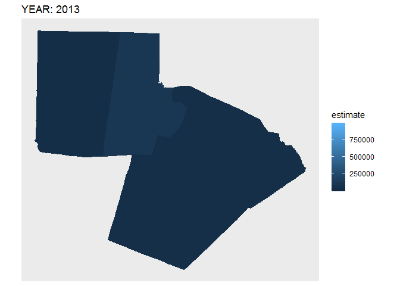

<!-- README.md is generated from README.Rmd. Please edit that file -->

```{r setup, include = FALSE}
knitr::opts_chunk$set(
  collapse = TRUE,
  comment = "#>"
)
```

The goal of refq_choropleth_slider was to demonstrate how to generate a plotly choropleth with a slider filtering the year.  As the plot turns, I've decided that a slider filter with geom_sf polygons is not a feasible goal.  BUT, animating the choropleth via `gganimate` seems to work well.

```
ggplot(bg_r) +
  geom_sf(aes(fill = estimate, color = estimate)) +
  labs(title = 'Year: {round(frame_time, 0)}') +
  transition_time(as.numeric(year)) +
  shadow_mark(past = TRUE, future = TRUE)
```


