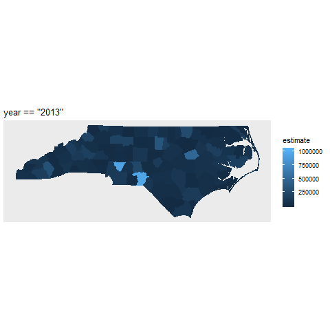

```{r}
library(tidyverse)
library(tidycensus)
library(gganimate)
```


```{r}
nc_2016 <- 
  get_acs(geography = "county",
          variables = "B01003_001",
          state = "NC",
          geometry = TRUE) %>% 
  mutate(year = "2016")

nc_2015 <- 
  get_acs(geography = "county",
          variables = "B01003_001",
          state = "NC",
          year = 2015,
          geometry = TRUE) %>% 
  mutate(year = "2015")

nc_2014 <- 
  get_acs(geography = "county",
          variables = "B01003_001",
          state = "NC",
          year = 2014,
          geometry = TRUE) %>% 
  mutate(year = "2014")

nc_2013 <- 
  get_acs(geography = "county",
          variables = "B01003_001",
          state = "NC",
          year = 2013,
          geometry = TRUE) %>% 
  mutate(year = "2013")
```


```{r}
big_table <- rbind(nc_2016, nc_2015, nc_2014, nc_2013) 
glimpse(big_table)

#big_table2 <- big_table
#st_geometry(big_table2) <- NULL
```


```{r}
nc_2016_r <- nc_2016
nc_2015_r <- nc_2015
nc_2014_r <- nc_2014
nc_2013_r <- nc_2013

nc_2016_r$estimate <- sample(nc_2016_r$estimate)
nc_2015_r$estimate <- sample(nc_2015_r$estimate)
nc_2014_r$estimate <- sample(nc_2014_r$estimate)
nc_2013_r$estimate <- sample(nc_2013_r$estimate)

bg_r <- rbind(nc_2016_r, nc_2015_r, nc_2014_r, nc_2013_r) 
```


```{r}

ggplot(bg_r) +
  geom_sf(aes(fill = estimate, color = estimate)) +
  facet_wrap(~year)
  
```

### transition_time

```{r}
ggplot(bg_r) +
  geom_sf(aes(fill = estimate, color = estimate)) +
  labs(title = 'Year: {round(frame_time, 0)}') +
  transition_time(as.numeric(year)) +
  shadow_mark(past = TRUE, future = TRUE)
```

```{r}
anim_save("animated_map.png")
```

### transition_states

```{r}
ggplot(bg_r) +
  geom_sf(aes(fill = estimate, color = estimate)) +
  labs(title = 'Year: {closest_state}') +
  transition_states(year, 
                    transition_length = 0.4, 
                    state_length = 0.4) +
  shadow_mark(past = TRUE, future = TRUE)
```


### transition_filter

```{r}
ggplot(bg_r) +
  geom_sf(aes(fill = estimate, color = estimate)) +
  coord_sf(datum = NA) +
  labs(title = '{next_expression}') +
  transition_filter(transition_length = 0.4, 
                    filter_length = 0.4,
                    year == "2013",
                    year == "2014",
                    year == "2015",
                    year == "2016") +
  enter_fade() +
  exit_fade() +
  shadow_mark(past = TRUE, future = TRUE)
```


```{r}
anim_save("anim_map2.png")
```


```{r}
ggplot(bg_r) +
  geom_sf(aes(fill = estimate, color = estimate)) +
  coord_sf(datum = NA) +
  labs(title = "{next_expression}") +
  transition_filter(transition_length = 0.4, 
                    filter_length = 0.4,
                    year == "2013",
                    year == "2014",
                    year == "2015",
                    year == "2016") +
  enter_fade() +
  exit_fade() +
  shadow_mark(past = TRUE, future = TRUE)
```

### Noodling

```{r}
bg_r_small <- bg_r %>% 
  mutate(county = str_extract(NAME, "\\w+")) %>% 
  filter(county == "Orange" | 
         county == "Wake" |
         county == "Durham")

nc_2013_r_small <- nc_2013_r %>% 
  mutate(county = str_extract(NAME, "\\w+")) %>% 
  filter(county == "Orange" | 
         county == "Wake" |
         county == "Durham")

nc_2014_r_small <- nc_2013_r %>% 
  mutate(county = str_extract(NAME, "\\w+")) %>% 
  filter(county == "Orange" | 
         county == "Wake" |
         county == "Durham")


nc_2015_r_small <- nc_2013_r %>% 
  mutate(county = str_extract(NAME, "\\w+")) %>% 
  filter(county == "Orange" | 
         county == "Wake" |
         county == "Durham")


nc_2016_r_small <- nc_2013_r %>% 
  mutate(county = str_extract(NAME, "\\w+")) %>% 
  filter(county == "Orange" | 
         county == "Wake" |
         county == "Durham")

nc_2016_r_small$estimate <-
  sample(nc_2016_r_small$estimate)
nc_2015_r_small$estimate <-
  sample(nc_2015_r_small$estimate)
nc_2014_r_small$estimate <-
  sample(nc_2014_r_small$estimate)
nc_2013_r_small$estimate <-
  sample(nc_2013_r_small$estimate)

```

```{r}
ggplot(bg_r_small) +
  geom_sf(aes(fill = estimate, color = estimate)) +
  labs(title = 'Year: {round(frame_time, 0) + 2}') +
  transition_time(as.numeric(year)) +
  shadow_mark(past = TRUE, future = TRUE)
```

```{r}
ggplot() +
  geom_sf(data = nc_2013_r_small,
          aes(fill = estimate, color = estimate)) +
  geom_sf(data = nc_2014_r_small,
          aes(fill = estimate, color = estimate)) +
  geom_sf(data = nc_2015_r_small,
          aes(fill = estimate, color = estimate)) +
  geom_sf(data = nc_2016_r_small,
          aes(fill = estimate, color = estimate)) +
  coord_sf(datum = NA) +
  labs(title = 
         'Year: {(as.numeric(previous_layer) + 2012)}') +
  transition_layers(layer_length = 0.4,
                    transition_length = 0.4,
                    keep_layers = FALSE) #+
  #enter_fade() #+ 
  #exit_fade() 

#  shadow_mark(past = TRUE, future = TRUE)
```


```{r}

yrs_txt <- c("2013", "2014", "2015", "2016")

ggplot(bg_r_small) +
  geom_sf(aes(fill = estimate, color = estimate)) +
  coord_sf(datum = NA) +
  labs(title = "YEAR: {str_replace(str_replace(as.character(next_expression), 'year == \"', ''), '\"', '')}") +
  transition_filter(transition_length = 0.4, 
                    filter_length = 0.4,
                    year == "2013",
                    year == "2014",
                    year == "2015",
                    year == "2016") +
  enter_fade() +
  exit_fade() +
  shadow_mark(past = TRUE, future = TRUE)
```

```{r}
anim_save("county_trans_filter.png")
```


### transition_layer

```{r}
ggplot() +
  geom_sf(data = nc_2013_r,
          aes(fill = estimate, color = estimate)) +
  geom_sf(data = nc_2014_r,
          aes(fill = estimate, color = estimate)) +
  geom_sf(data = nc_2015_r,
          aes(fill = estimate, color = estimate)) +
  geom_sf(data = nc_2016_r,
          aes(fill = estimate, color = estimate)) +
  coord_sf(datum = NA) +
  labs(title = 'Year: ({2012 + next_layer})') +
  transition_layers(layer_length = 0.4,
                    transition_length = 0.4,
                    keep_layers = FALSE) #+
  #enter_fade() + 
  #exit_fade()
  #shadow_mark(past = TRUE, future = TRUE) 
```



