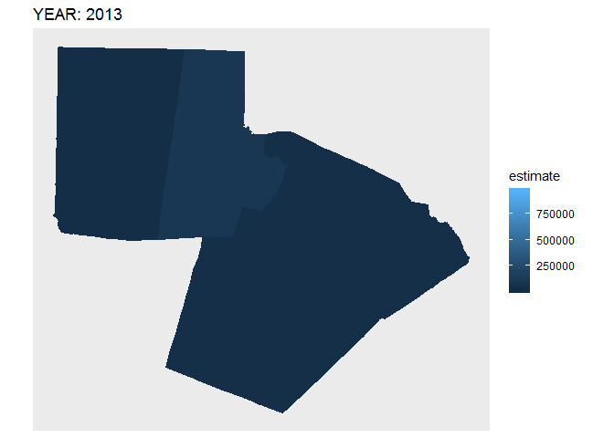

Load Libraries

```{r}
library(tidyverse)
library(tidycensus)
library(gganimate)
options(tigris_use_cache = TRUE)
```

Get Census ACS data.  The data are population data (Actually I don't recall the definition of the 'B01003_001' variable.)  However I have scrambled the data to make the changes more apparent overtime. I used the `sample()` function to change the associated population estimate for the counties.

```{r}
nc_2016 <- 
  get_acs(geography = "county",
          variables = "B01003_001",
          state = "NC",
          geometry = TRUE,
          cache_table = TRUE) %>% 
  mutate(year = "2016")

nc_2015 <- 
  get_acs(geography = "county",
          variables = "B01003_001",
          state = "NC",
          year = 2015,
          geometry = TRUE,
          cache_table = TRUE) %>% 
  mutate(year = "2015")

nc_2014 <- 
  get_acs(geography = "county",
          variables = "B01003_001",
          state = "NC",
          year = 2014,
          geometry = TRUE,
          cache_table = TRUE) %>% 
  mutate(year = "2014")

nc_2013 <- 
  get_acs(geography = "county",
          variables = "B01003_001",
          state = "NC",
          year = 2013,
          geometry = TRUE,
          cache_table = TRUE) %>% 
  mutate(year = "2013")
```


```{r}
big_table <- rbind(nc_2016, nc_2015, nc_2014, nc_2013) 
glimpse(big_table)

#big_table2 <- big_table
#st_geometry(big_table2) <- NULL
```

Below is one spot where I randomize the data estimate associated with the counties.

```{r}
nc_2016_r <- nc_2016
nc_2015_r <- nc_2015
nc_2014_r <- nc_2014
nc_2013_r <- nc_2013

nc_2016_r$estimate <- sample(nc_2016_r$estimate)
nc_2015_r$estimate <- sample(nc_2015_r$estimate)
nc_2014_r$estimate <- sample(nc_2014_r$estimate)
nc_2013_r$estimate <- sample(nc_2013_r$estimate)

bg_r <- rbind(nc_2016_r, nc_2015_r, nc_2014_r, nc_2013_r) 
```

## Facet Maps

Facet Maps are amazingly effective at showing change.  Perhaps this is actually better than animating.  It's certainly far less work.

```{r}

ggplot(bg_r) +
  geom_sf(aes(fill = estimate, color = estimate)) +
  coord_sf(crs = 4326, datum = NA) +
  facet_wrap(~year)
  
```

## Bar Plot

It might make even more sense to simply show the change in certain couches by using a side-by-side bar plot

```{r}
bg_r_nogeom <- bg_r
sf::st_geometry(bg_r_nogeom) <- NULL  # remove geometry layer from the SF Tibble

bg_r_nogeom %>% 
  mutate(county = str_extract(NAME, "\\w+")) %>% 
  filter(county == "Mecklenburg" | 
           county == "Durham" | 
           county == "Guilford") %>% 
  select(county, estimate, year) %>% 
  gather("foo", "year", -county, -estimate) %>% 
  ggplot() +
  geom_col(aes(x = county, y = estimate, fill = year), 
           position = "dodge") +
  scale_fill_viridis_d() +
  coord_flip() 
```

## Annimations

IN the following sections I explore and document different methods of animating the choropleth.  The primary function that needs to be leveraged is the `transition_` function.  The following examples use `transition_time`, `transition_states`, `transition_filter`, and `transition_layers`.

### transition_time

In this first example I see that I can make the `transition_time` function work fine.  the `frame_time` label variable is presented up in the `ggplot` element however the documentation for which labels work in which transition states can be found under the **Label variables** section of each *transition* function's [respective documentation](https://gganimate.com/reference/transition_time.html).  Additional *label variables* are mentioned in the `animate` function.

The plot below works pretty well but the transition animates are a bit slow and weird.  Note, in particular, the reaches of the southern [inlets](https://en.wikipedia.org/wiki/Sound_(geography)#United_States)


```{r}
ggplot(bg_r) +
  geom_sf(aes(fill = estimate, color = estimate)) +
  labs(title = 'Year: {round(frame_time, 0)}') +
  transition_time(as.numeric(year)) +
  shadow_mark(past = TRUE, future = TRUE)
```

Another option is to make the animated plot as an R object.  Then use the `gganimate::animate()` function to visualize the animate the object.  For example...

```r
foo <- ggplot(bg_r) +
  geom_sf(aes(fill = estimate, color = estimate)) +
  labs(title = 'Year: {round(frame_time, 0)}') +
  transition_time(as.numeric(year)) +
  shadow_mark(past = TRUE, future = TRUE)

animate(foo)

```

To save the animation as a file, use `anim_save()`

```r
anim_save("animated_map.png")
```

### transition_states

As a result of the above funky transitions, I explored a whole series of other transition options. Here I also set arguments for the length of time between transition and pause (`state_length`), as well as use the `shadow_mark` function in an attempt to manage a cleaner set of transitions.  

I like these transitions much better.  However, I'm not entirely sure what constitutes a "state" or a change in state.  That becomes a bit more apparent when trying to line up the *closest_state* label with the actual state of change.  Since there are one hundred polygons for each state change (in my mind), the actual animation (below) appears to have a different definition of "state" than what I think state is.

```{r}
ggplot(bg_r) +
  geom_sf(aes(fill = estimate, color = estimate)) +
  labs(title = 'Year: {closest_state}') +
  transition_states(year, 
                    transition_length = 0.4, 
                    state_length = 0.4) +
  shadow_mark(past = TRUE, future = TRUE)
```


### transition_filter

So _filter seems like a nice approach now.  Because I can filter each transition by year.  The only major problem now is that the ggplot title, taken from the `next_expression` label is a bit off.  It needs some text processing which I do more effectively down in the "Noodling" section below.

```{r}
ggplot(bg_r) +
  geom_sf(aes(fill = estimate, color = estimate)) +
  coord_sf(datum = NA) +
  labs(title = '{next_expression}') +
  transition_filter(transition_length = 0.4, 
                    filter_length = 0.4,
                    year == "2013",
                    year == "2014",
                    year == "2015",
                    year == "2016") +
  enter_fade() +
  exit_fade() +
  shadow_mark(past = TRUE, future = TRUE)
```


```{r}
anim_save("animated_map.png")
```


### transition_layer

The `next_layer` argument works here if I use the `as.numeric` function before adding a number.

As you can see, manipulating the label variables can be quite a trick.

```{r}
ggplot() +
  geom_sf(data = nc_2013_r,
          aes(fill = estimate, color = estimate)) +
  geom_sf(data = nc_2014_r,
          aes(fill = estimate, color = estimate)) +
  geom_sf(data = nc_2015_r,
          aes(fill = estimate, color = estimate)) +
  geom_sf(data = nc_2016_r,
          aes(fill = estimate, color = estimate)) +
  coord_sf(datum = NA) +
  labs(title = 'Year: ({2012 + as.numeric(next_layer)})') +
  transition_layers(layer_length = 0.4,
                    transition_length = 0.4,
                    keep_layers = FALSE) #+
  #enter_fade() + 
  #exit_fade()
  #shadow_mark(past = TRUE, future = TRUE) 
```


### Noodling

First, some more file wrangling.  It's become apparent that noodling around with 100 polygons is slow.  Maybe it will be better if I work with only three counties.

```{r}
bg_r_small <- bg_r %>% 
  mutate(county = str_extract(NAME, "\\w+")) %>% 
  filter(county == "Orange" | 
         county == "Wake" |
         county == "Durham")

nc_2013_r_small <- nc_2013_r %>% 
  mutate(county = str_extract(NAME, "\\w+")) %>% 
  filter(county == "Orange" | 
         county == "Wake" |
         county == "Durham")

nc_2014_r_small <- nc_2013_r %>% 
  mutate(county = str_extract(NAME, "\\w+")) %>% 
  filter(county == "Orange" | 
         county == "Wake" |
         county == "Durham")


nc_2015_r_small <- nc_2013_r %>% 
  mutate(county = str_extract(NAME, "\\w+")) %>% 
  filter(county == "Orange" | 
         county == "Wake" |
         county == "Durham")


nc_2016_r_small <- nc_2013_r %>% 
  mutate(county = str_extract(NAME, "\\w+")) %>% 
  filter(county == "Orange" | 
         county == "Wake" |
         county == "Durham")

nc_2016_r_small$estimate <-
  sample(nc_2016_r_small$estimate)
nc_2015_r_small$estimate <-
  sample(nc_2015_r_small$estimate)
nc_2014_r_small$estimate <-
  sample(nc_2014_r_small$estimate)
nc_2013_r_small$estimate <-
  sample(nc_2013_r_small$estimate)

```

Back to using `transition_time`, this operation is faster because there are only three counties.  I'm also practicing how to manipulate the title label from the `fame_time` label variable.  It seems to work fine with arithmetic functions.  In this case I'm adding two to each year (just to see if it works), as well as rounding the number to be only whole numbers.

```{r}
ggplot(bg_r_small) +
  geom_sf(aes(fill = estimate, color = estimate)) +
  labs(title = 'Year: {round(frame_time, 0) + 2}') +
  transition_time(as.numeric(year)) +
  shadow_mark(past = TRUE, future = TRUE)
```

So let's try `transition_layers`.  This seems to work well, but there is still a problem with the title.  Something about the states again.  So I suspect the layers are not quite what I need -- or I need to learn more about what a layer is and how it relates to my goal.

```{r}
ggplot() +
  geom_sf(data = nc_2013_r_small,
          aes(fill = estimate, color = estimate)) +
  geom_sf(data = nc_2014_r_small,
          aes(fill = estimate, color = estimate)) +
  geom_sf(data = nc_2015_r_small,
          aes(fill = estimate, color = estimate)) +
  geom_sf(data = nc_2016_r_small,
          aes(fill = estimate, color = estimate)) +
  coord_sf(datum = NA) +
  labs(title = 
         'Year: {(as.numeric(previous_layer) + 2012)}') +
  transition_layers(layer_length = 0.4,
                    transition_length = 0.4,
                    keep_layers = FALSE) #+
  #enter_fade() #+ 
  #exit_fade() 

#  shadow_mark(past = TRUE, future = TRUE)
```

Anyway, back to the labels.  I went out of my `stringr` way to manipulate the text as best I could.  It seems to work.  I could be more elegant in my `str_replace` command.  One thing I did discover is that `str_extract` didn't work because I could not insert escape characters into the `labs` function, at least not in any functional way.

```{r}

yrs_txt <- c("2013", "2014", "2015", "2016")

ggplot(bg_r_small) +
  geom_sf(aes(fill = estimate, color = estimate)) +
  coord_sf(datum = NA) +
  labs(title = "YEAR: {str_replace(str_replace(as.character(next_expression), 'year == \"', ''), '\"', '')}") +
  transition_filter(transition_length = 0.4, 
                    filter_length = 0.4,
                    year == "2013",
                    year == "2014",
                    year == "2015",
                    year == "2016") +
  enter_fade() +
  exit_fade() +
  shadow_mark(past = TRUE, future = TRUE)
```

```{r}
anim_save("county_trans_filter.png")
```




