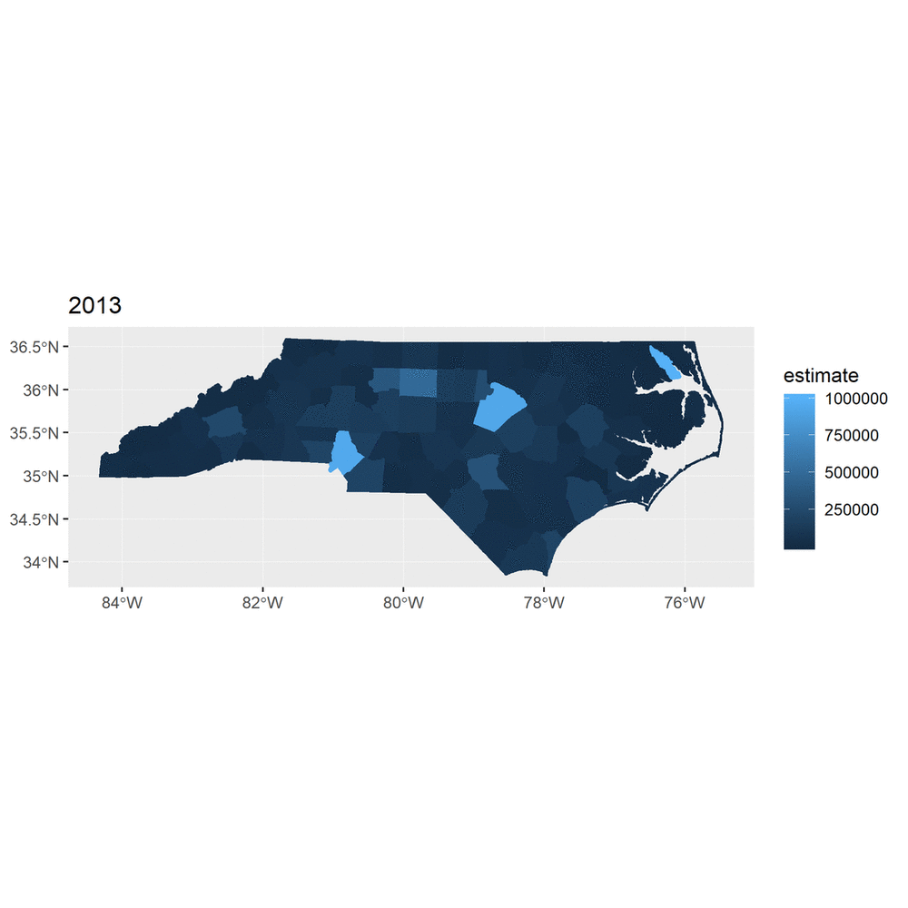

## Load Libraries

```{r}
library(tidyverse)
library(tidycensus)
library(sf)
library(crosstalk)
library(leaflet)
library(gganimate)
library(tweenr)
library(transformr)
```


## Get Census Data

```{r}
nc_2016 <- 
  get_acs(geography = "county",
          variables = "B01003_001",
          state = "NC",
          geometry = TRUE) %>% 
  mutate(year = "2016")

nc_2015 <- 
  get_acs(geography = "county",
          variables = "B01003_001",
          state = "NC",
          year = 2015,
          geometry = TRUE) %>% 
  mutate(year = "2015")

nc_2014 <- 
  get_acs(geography = "county",
          variables = "B01003_001",
          state = "NC",
          year = 2014,
          geometry = TRUE) %>% 
  mutate(year = "2014")

nc_2013 <- 
  get_acs(geography = "county",
          variables = "B01003_001",
          state = "NC",
          year = 2013,
          geometry = TRUE) %>% 
  mutate(year = "2013")
```

## Bind Rows

```{r}
big_table <- rbind(nc_2016, nc_2015, nc_2014, nc_2013) 
glimpse(big_table)

big_table2 <- big_table
st_geometry(big_table2) <- NULL
```


## Test

first:  ggplot facet_wrap

```{r}
bg1 <- big_table %>% 
  #filter(NAME == "Pasquotank County, North Carolina")
  mutate(estimate = if_else(estimate == 40419, 1000000, estimate)) %>% 
  mutate(estimate = if_else(estimate == 40233, 900000, estimate)) %>% 
  mutate(estimate = if_else(estimate == 40018, 500000, estimate))
  
           

ggplot(bg1) +
  geom_sf(aes(fill = estimate, color = estimate)) +
  facet_wrap(~ year)
```


Second:  side by side bargraph

```{r}
big_table2 %>% 
  mutate(county = str_extract(NAME, "\\w+")) %>% 
  filter(county == "Mecklenburg" | 
           county == "Durham" | 
           county == "Guilford") %>% 
  select(county, estimate, year) %>% 
  gather("foo", "year", -county, -estimate) %>% 
  ggplot() +
  geom_col(aes(x = county, y = estimate, fill = year), 
           position = "dodge") +
  scale_fill_viridis_d() +
  coord_flip() 
```

Third:  Simple ggplotly for one year (2016) but no slider.

```{r}
ggnc <- ggplot(nc_2016) +
  geom_sf(aes(fill = estimate, color = estimate)) 

ggplotly(ggnc)


```

fourth:  crosstalk shared data & slider

```{r}
bg2 <- big_table %>% 
  mutate(year = as.Date(as.character(year),
                        format = "%Y"))

shared_bigtable <- SharedData$new(bg2)
```

```{r}
nc_share_slide <- filter_slider("mapyear", "YEAR", shared_bigtable, 
              column=~year, timeFormat = "%Y")
```


```{r}
GreenPalette <- colorNumeric(palette = "Greens",
                               domain = big_table$estimate)

big_table %>% 
  st_transform(crs = "+init=epsg:4326") %>%
  leaflet(width = "100%") %>%
  addProviderTiles(provider = "CartoDB.Positron") %>% 
  addPolygons(fillOpacity = 0.7,
              smoothFactor = 0,
              stroke = FALSE, 
              color = ~GreenPalette(estimate))
```


```{r}
GreenPalette <- colorNumeric(palette = "Greens",
                               domain = big_table$estimate)

nc_share_leaf <- (shared_bigtable %>% 
  #st_transform(crs = "+init=epsg:4326") %>%
  leaflet(width = "100%") %>%
  addProviderTiles(provider = "CartoDB.Positron") %>% 
  addPolygons(fillOpacity = 0.7,
              smoothFactor = 0,
              stroke = FALSE, 
              color = ~GreenPalette(estimate)))
```


```{r}
bscols(nc_share_slide, nc_share_leaf)
```


Fifth:  Make separate plots and animate laer


```{r}
plot_13 <- ggplot(nc_2013 %>% 
                    mutate(estimate = if_else(estimate == 40419, 1000000, estimate))) +
  geom_sf(aes(fill = estimate, color = estimate)) +
  ggtitle("2013")

plot_14 <- ggplot(nc_2014 %>% mutate(estimate = if_else(estimate == 40233, 900000, estimate))) +
  geom_sf(aes(fill = estimate, color = estimate)) +
  ggtitle("2014") 

plot_15 <- ggplot(nc_2015 %>% mutate(estimate = if_else(estimate == 40018, 500000, estimate))) +
  geom_sf(aes(fill = estimate, color = estimate)) +
  ggtitle("2015")

plot_16 <- ggplot(nc_2016) +
  geom_sf(aes(fill = estimate, color = estimate)) +
  ggtitle("2016")


ggsave("plot13.png", plot_13)
ggsave("plot14.png", plot_14)
ggsave("plot15.png", plot_15)
ggsave("plot16.png", plot_16)

# Go To https://gifmaker.me/
```

Annimate iwth https://gifmaker.me

and get this:



## gganimate

an example

```{r}
earth <- sf::st_as_sf(rnaturalearth::countries110)
views <- data.frame(rbind(
  st_bbox(earth[earth$name == 'Denmark',]),
  st_bbox(earth[earth$name == 'Australia',])
))
p <- ggplot() + 
  geom_sf(data = earth, fill = 'white') + 
  geom_sf(data = earth[earth$name %in% c('Denmark', 'Australia'),], fill = 'forestgreen') + 
  theme(panel.background = element_rect('lightblue')) + 
  view_zoom_manual(1, 1, xmin = views$xmin, xmax = views$xmax, ymin = views$ymin, ymax = views$ymax, wrap = TRUE)
animate(p, 100, 10)
```

## gganimate exploration

```{r}
polyplot <- function(data) {
  p <- ggplot(data) + 
    geom_polygon(aes(x, y, group = id, fill = col)) +
    scale_fill_identity() +
    coord_fixed(xlim = c(-1.5, 1.5), ylim = c(-1.5, 1.5))
  plot(p)
}

star <- poly_star()
star$col <- 'steelblue'
circles <- poly_circles()
circles$col <- c('forestgreen', 'firebrick', 'goldenrod')[circles$id]

animation <- tween_polygon(star, circles, 'cubic-in-out', 40, id) %>% 
  keep_state(10)

ani <- lapply(split(animation, animation$.frame), polyplot)
```

```{r}
from_below <- function(data) {
  data$y <- data$y - 2
  data
}
animation <- tween_polygon(star, circles, 'cubic-in-out', 40, id, enter = from_below) %>% 
  keep_state(10)

ani <- lapply(split(animation, animation$.frame), polyplot)
```

